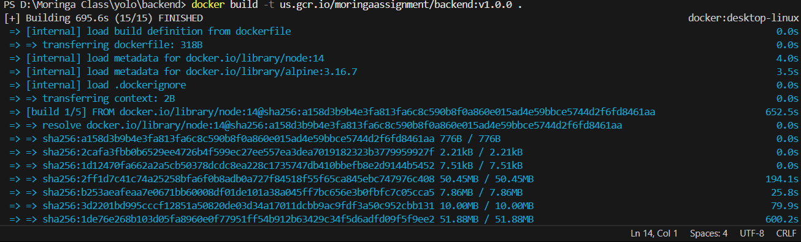
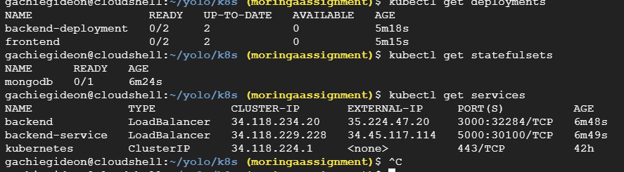

# Overview
This project involved the containerization and deployment of a full-stack yolo application using Docker.

Load balancer ip address 35.224.47.20

Frontend  35.224.47.20:3000
Backend  35.224.47.20:5000

## Prerequisites
- Docker
- Kubernetes
- Google Cloud SDK

Deploy Containers to artifact Registry

Running the deplyments, secrets and services

kubectl apply -f backend-deployment.yaml
kubectl apply -f frontend-deployment.yaml
kubectl apply -f mongodb-deployment.yaml

